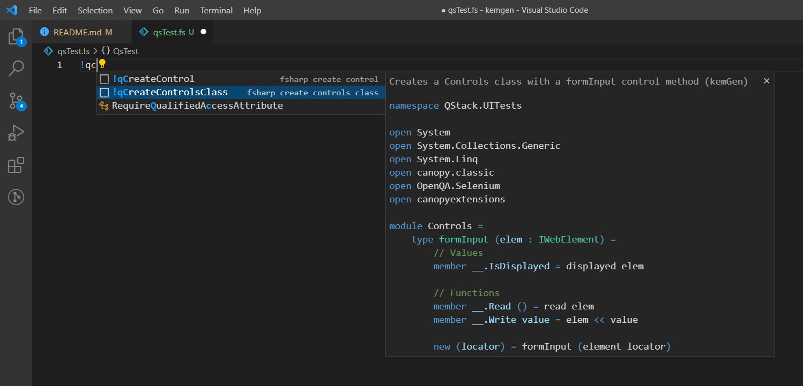
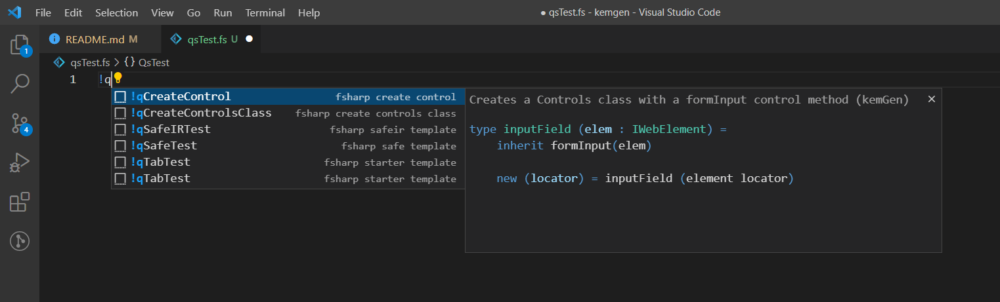

# kemgen README

KemGen, aka qaGen, is an F# code snippet generator.  Excellent for testing with the Canopy test framework!

>Note: Extension is not yet published.  

>Tip: Just drop the folder into this directory to use it: C:\Users\username\.vscode\extensions
## Features

No longer will you have to type out entire tests from scratch.

## Requirements

No requirements necessary as of now.

## Extension Settings

For example:

Try some of these sample snippets.  More to come, I promise!

* `!qSafeTest`: Creates a SAFE Test template in F#
* `!qTabTest`:  Creates Template for a Modal Test in F#

## Known Issues

Needs way more snippet data added
## Release Notes

Added first snippet.
### 0.0.1

Added first snippet.

-----------------------------------------------------------------------------------------------------------

 **QStack**

